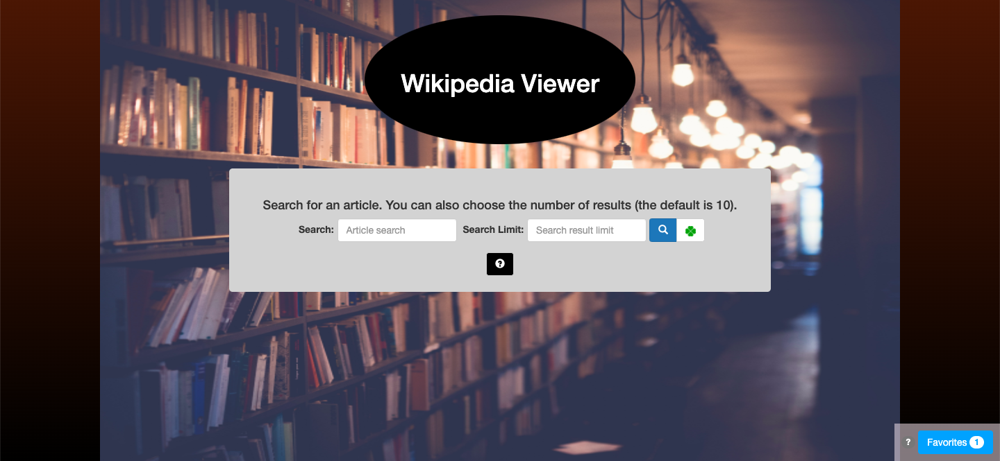

<h2> About Me </h2>
 
Traveling around the world to places, like South Korea and Costa Rica, as a military brat and a college student, I discovered my passion for learning foreign languages. However, it was not until the fall of 2016 when I decided to pursue a longtime interest in computer related fields that I discovered that passion extended to learning computer languages as well. After going through a few online Web Development lessons, I realized I really enjoyed being able to create programs using programming languages, like JavaScript, to do an infinite number of things and the challenge of solving problems to make those programs function. Since then I have continued to utilize online courses, like Free Code Camp and Codecademy, to learn Web Development skills and apply those skills by doing projects. I am currently looking for any opportunities in Front-end Development.

<h2>Skills </h2>

Languages

*   HTML5, CSS3, SCSS, JavaScript, PHP, SQL

Frameworks/Libraries

*   Bootstrap, jQuery, React

Technologies

*   Git, Github, AJAX, Slack, MySQL, Node.js, CSS Grid, Flexbox, MongoDB 

<h2>Education/Certificates </h2>

Freecodecamp (2016-2018)

*   <a target="_blank" href="https://www.freecodecamp.org/certification/kaykay1424/javascript-algorithms-and-data-structures" >JavaScript Algorithms and Data Structures Certificate</a>
*   <a target="_blank" href="https://www.freecodecamp.org/certification/kaykay1424/responsive-web-design">Responsive Web Design Certificate </a>
*   <a target="_blank" href="https://www.freecodecamp.org/certification/kaykay1424/front-end-libraries">Frontend Libraries Certificate</a>
*   <a target="_blank" href="https://www.freecodecamp.org/certification/kaykay1424/apis-and-microservices">APIs and Microservices Certificate</a>
*   <a target="_blank"  href="https://www.freecodecamp.org/kaykay1424/front-end-certification">Frontend Certificate</a> 

Testdome (2018)

*   <a target="_blank" href="https://www.testdome.com/cert/1ed0272bf30840f1893133180c18f4c4">JavaScript and SQL Certificate</a>		
*   <a target="_blank"  href="https://www.testdome.com/cert/1a1ad583155e48cdb9a4217155acdad3">HTML/CSS, JavaScript, PHP, and SQL Certificate</a> 		
*   <a target="_blank" href="https://www.testdome.com/cert/44b6e14667074acbb144982f7c127542">HTML/CSS and Bootstrap Certificate</a>		
*   <a target="_blank"  href="https://www.testdome.com/cert/9d35e07389ce4657bf408f02a1676e04">JavaScript with jQuery Certificate</a>  

<h2>Projects </h2>

Tic Tac Toe

The Tic Tac Toe game lets users choose whether to play alone with the computer or play with someone else and whether to play as X or O. The player that gets 3 Xs or Os in a row wins. If all the squares are filled and no player has gotten 3 in a row, that results in a tie and the game will restart.

<a target="_blank" href="Tic-Tac-Toe/index.html" >View project</a> | <a target="_blank" href="https://github.com/kaykay1424/kaykay1424.github.io/tree/master/dev-portfolio/Tic-Tac-Toe">View code</a>

HTML

CSS

JavaScript

 jQuery 

Wikipedia Viewer

The Wikipedia Viewer allows users to search for a Wikipedia article and choose the amount of articles to be returned. Users can bookmark an article to read later or favorite an article, which will then be stored in the browser's local storage.

<a target="_blank" href="Wikipedia-Viewer/index.html" >View project</a> | <a target="_blank" href="https://github.com/kaykay1424/kaykay1424.github.io/tree/master/dev-portfolio/Wikipedia-Viewer">View code</a>

HTML

CSS

 Bootstrap 

JavaScript

 jQuery 

 API 

The Electronics Store

The Electronics Store is an example e-commerce site where users can add products, like TVs and cameras, to their shopping cart or wish list, search for products by name, price, discount, brand, or category, purchase products through Paypal, and contact the store. It also includes an admin panel to manage products and customers.

<a target="_blank" href="https://the-electronics-store.herokuapp.com/" >View project</a> 

HTML

CSS

 Bootstrap 

JavaScript

 jQuery 

 SQL 

 MySQL 

 PostgreSQL 

 PHP 

