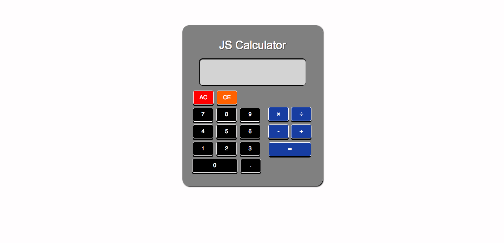

## Quick Facts

`<education>`

B.A. in Spanish and World Business with Chinese minor from University of Tennessee at Knoxville

`</education>`

`<devexp>`

1 yr+ learning Full Stack Development online

`</devexp>`

`<hobbies>`

*   Basketball
*   Soccer
*   Music (Hip Hop, R&B, Pop, Rock, Soul, Salsa, Bachata, Merengue, Sertanejo, pretty much everything)
*   Movies (Action, Comedy, Romance)
*   Traveling
*   Learning languages (both computer and human)

`</hobbies>`

## About Me

Traveling around the world to places, like South Korea and Costa Rica, as a military brat and a college student, I discovered my passion for learning foreign languages. However, it was not until the fall of 2016 when I decided to pursue a longtime interest in computer related fields that I discovered that passion extended to learning computer languages as well. After going through a few online Web Development lessons, I realized I really enjoyed being able to create programs using programming languages, like JavaScript, to do an infinite number of things and the challenge of solving problems to make those programs function. Since then I have continued to utilize online courses, like Free Code Camp and Codecademy (view more of the courses I have completed [here](courses.html) ), to learn Web Development skills and apply those skills by doing projects. I am working to become a Full Stack Developer and am looking for any opportunities in either Frontend or Backend Development or both.

## Projects

### JavaScript Calculator

The JavaScript Calculator can solve operations involving multiplication, division, subtraction, and addition.

[View project](Javascript-Calculator/index.html) | [View code](https://github.com/kaykay1424/kaykay1424.github.io/tree/master/dev-portfolio/Javascript-Calculator)

HTML

CSS

JavaScript

jQuery

### Random Quote Generator

The Random Quote Generator lets users view random inspirational quotes, view the source of the quote as well as tweet the current quote along with the author on a new page.

[View project](Random-Quote-Generator/index.html) | [View code](https://github.com/kaykay1424/kaykay1424.github.io/tree/master/dev-portfolio/Random-Quote-Generator)

HTML

CSS

Bootstrap

JavaScript

jQuery

API

### The Electronics Store

The Electronics Store is an example e-commerce site where users can add products, like TVs and cameras, to their shopping cart or wish list, search for products by name, price, discount, brand, or category, purchase products through Paypal, and contact the store. It also includes an admin panel to manage products and customers.

[View project](https://the-electronics-store.herokuapp.com/ )

HTML

CSS

Bootstrap

JavaScript

jQuery

SQL

MySQL

PostgreSQL

PHP

